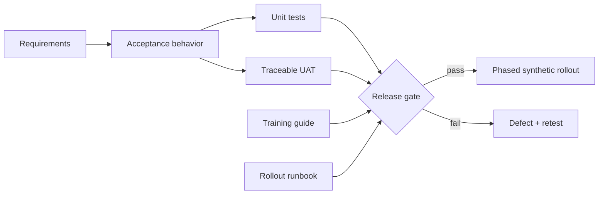

# Enterprise Implementation Lab

A synthetic, dependency-free reference project that makes the path from
requirements to UAT, training, and rollout visible and testable.

[](https://github.com/oguzhanozfe/enterprise-implementation-lab/actions/workflows/ci.yml)

> Portfolio scope: this is a fictional implementation lab built with synthetic
> data. It is not a production banking system and contains no client code,
> customer data, credentials, or confidential documentation.

## Why this project exists

Enterprise delivery is more than writing an endpoint. Teams need a shared
problem definition, traceable acceptance criteria, repeatable UAT evidence,
operator guidance, rollout gates, and a clear stop/rollback decision.

This repository packages those artifacts around a deliberately small mock
activation service so the entire workflow can be reviewed in minutes.

## Delivery map



## What is included

- Machine-readable [requirements](data/requirements.json)
- A small [mock service](src/implementation_lab/service.py) with documented
  validation and retry behavior
- Requirement-linked [UAT cases](data/uat_cases.json) and a JSON report runner
- A [traceability matrix](docs/traceability-matrix.md)
- [UAT plan](docs/uat-plan.md), [operator guide](docs/training-guide.md), and
  [rollout runbook](docs/rollout-runbook.md)
- Automated unit and UAT gates in GitHub Actions
- Explicit [design decisions and limitations](docs/decision-log.md)

## Run locally

Python 3.11+ is enough; there are no runtime dependencies.

```bash
python3 -m unittest discover -s tests -v
python3 scripts/run_uat.py
```

Expected UAT summary:

```json
{
  "total": 6,
  "passed": 6,
  "failed": 0
}
```

## What this demonstrates

- Translating business requirements into explicit technical behavior
- Keeping business, engineering, QA, training, and rollout evidence connected
- Designing happy-path and rejection-path acceptance tests
- Building a go/no-go gate that fails visibly
- Communicating scope boundaries instead of overstating a prototype

## Limits

This lab intentionally omits real identity verification, authentication,
persistence, payments, observability, security certification, and regulatory
controls. Production readiness is not claimed.

## License

MIT for the code and documentation in this repository.
